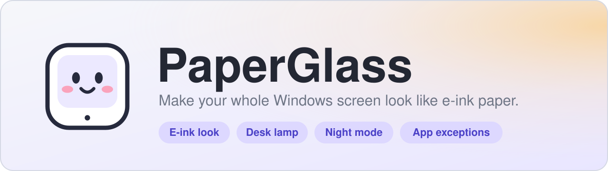

<p align="center">
  
</p>

<p align="center">
  <a href="../../releases/latest"></a>
</p>

<p align="center">
  
  
  
  
  
</p>

**PaperGlass** turns your whole Windows display into something that looks and feels like an e-ink page:
matte grayscale, a warm paper white, soft ink blacks and a fine film grain. It sits over everything you
do, on every monitor, and puts everything back the moment you quit.

It also has a **desk lamp** that casts a warm pool of light across the screen, a **night mode** with a
schedule, **per-app exceptions** for video and photo work, rebindable **hotkeys**, and small soft
sounds. Free, offline, no account, no telemetry.

<!--
  Add screenshots here once you have them, for example:

  <p align="center">
    
    
  </p>
-->

## Contents

- [Features](#features)
- [Install](#install)
- [Using PaperGlass](#using-paperglass)
- [Default hotkeys](#default-hotkeys)
- [Run or build from source](#run-or-build-from-source)
- [Optional: cover the Start menu and Quick Settings](#optional-cover-the-start-menu-and-quick-settings)
- [Troubleshooting](#troubleshooting)
- [How it works](#how-it-works)
- [Privacy](#privacy)
- [Contributing](#contributing)
- [License](#license)

## Features

**The e-ink look**
- Real grayscale over the whole desktop, including the taskbar, Start menu and Quick Settings.
- Paper tone from cool to warm, ink depth, contrast, brightness and effect strength.
- Film grain and gentle edge shading, like a front-lit panel.
- Five looks: **Paper**, **Carta**, **Newsprint**, **Kaleido** (muted colour) and **Night**.
- Save your own looks and bring them back with one click.
- A refresh flash when you switch things on, Off, Soft or Full, like a real e-ink panel clearing itself.

**Desk lamp**
- Tap where your lamp sits: left, right, or above the screen.
- Light, warmth (soft white to amber), spread and room dimming.
- Fades in and out smoothly.

**Night mode**
- Switch it on by hand or run it on a schedule with start and end times and chosen weekdays.
- Pick any built-in or saved look for the night, add extra dimming, and turn the lamp on automatically.

**App exceptions**
- Step aside while apps like video players, photo editors or games are in front, then fade back.
- Or do the opposite: filter only the apps you choose.

**Everything else**
- Global hotkeys you can rebind, with a warning if another app already uses a combination.
- Sounds in two styles, gentle chimes or paper rustle, with a volume control.
- Start with Windows, start hidden in the tray, works on multiple monitors.
- Quit, and your display colours go straight back to normal.

## Install

1. Open the [latest release](../../releases/latest) and download **`PaperGlass-Setup.exe`**.
2. Run it. It is a normal Windows setup: it shows the privacy policy, installs just for you by default (you can
   choose all users), adds a Start menu shortcut, and offers a desktop shortcut and "start with Windows".
3. Launch **PaperGlass** from the Start menu.

> **Windows may say "Windows protected your PC".** The installer is not signed with a paid code-signing
> certificate, so SmartScreen shows this for new apps. Choose **More info**, then **Run anyway**. If you
> would rather not, you can [build it from source](#run-or-build-from-source) and read every line first.

**Requirements:** Windows 10 or 11, 64-bit.

To remove it, use **Settings > Apps > Installed apps > PaperGlass > Uninstall**. The uninstaller asks whether to
delete your settings too.

## Using PaperGlass

The window has seven tabs down the left side.

| Tab | What it does |
| --- | --- |
| **Look** | Pick a look, fine-tune it with sliders, and save your own. |
| **Lamp** | Turn the desk lamp on and choose where it sits, how bright and how warm. |
| **Night** | Night mode now, or on a schedule, with its own look and dimming. |
| **Apps** | Choose apps where PaperGlass should step aside (or the only apps to filter). |
| **Hotkeys** | Turn hotkeys on or off and set your own shortcuts. |
| **Settings** | Start with Windows, sounds, refresh flash, close behaviour. |
| **Support** | Quick answers, copy diagnostics, restore the screen, reset everything. |

The big switch at the bottom of the sidebar turns the whole filter on and off. The **–** button hides the
window to the tray (the filter keeps running). **Quit and restore** closes PaperGlass and puts your screen back.

## Default hotkeys

| Shortcut | Action |
| --- | --- |
| `Ctrl` + `Alt` + `E` | E-ink on or off |
| `Ctrl` + `Alt` + `L` | Desk lamp on or off |
| `Ctrl` + `Alt` + `N` | Night mode on or off |
| `Ctrl` + `Alt` + `R` | Refresh flash |
| `Ctrl` + `Alt` + `P` | Open the PaperGlass window |

Change any of them in the **Hotkeys** tab.

## Run or build from source

You need **Windows 10/11** and **Python 3.10 or newer** ([python.org](https://www.python.org/downloads/), tick
"Add python.exe to PATH").

**Run it straight away**

```bat
install_and_run.bat
```

or by hand:

```bat
pip install PySide6
pythonw paperglass.py
```

**Build a Windows installer** (the same `PaperGlass-Setup.exe` you download from Releases)

```bat
make_installer.bat
```

This installs PyInstaller, builds the app, installs [Inno Setup](https://jrsoftware.org/isinfo.php) with
`winget` if it is missing, and writes `installer\PaperGlass-Setup.exe`.

**Just the app folder, no installer**

```bat
build_exe.bat
```

Then run `dist\PaperGlass\PaperGlass.exe`.

## Optional: cover the Start menu and Quick Settings

The gray and paper tone already cover everything, because Windows applies it to the whole screen. The film
grain, lamp glow and refresh flash are a transparent layer on top, and Windows keeps the Start menu and Quick
Settings above ordinary windows, so that layer stops just underneath them.

The only supported way past that is a Windows feature called **UIAccess**, which needs the app to be signed and
installed under Program Files. If you want it:

```bat
build_full_coverage.bat
```

It builds a special copy, then asks for administrator permission and runs `setup_full_coverage.ps1`, which:

1. copies the app to `C:\Program Files\PaperGlass`,
2. creates a certificate on your PC just for PaperGlass and signs the app with it,
3. adds only the **public** half of that certificate to your trusted stores, and deletes the private key,
4. adds a Start menu shortcut.

To undo everything, run `remove_full_coverage.ps1` as administrator. In the app, **Settings** shows
**Covered** when this is active.

> Do not run the special copy from the build folder. Windows refuses to start a UIAccess app that is not signed
> and installed in Program Files (you would see "A referral was returned from the server").
> This is an advanced, optional step; the normal installer does not need it.

## Troubleshooting

**The screen is stuck in gray.**
Use **Support > Restore screen now**, or quit PaperGlass. Windows drops the effect as soon as the app closes.

**A warning says Windows would not start the screen colour effect.**
Another feature is using it. Close Windows Magnifier and turn off **Settings > Accessibility > Color filters**,
then restart PaperGlass.

**Grain or lamp is missing over the Start menu or Quick Settings.**
See [the optional setup above](#optional-cover-the-start-menu-and-quick-settings).

**Video, photos or a game look wrong.**
Add that app on the **Apps** tab. In exclusive-fullscreen games the grain layer may be hidden anyway.

**HDR is on and nothing changes.**
The Windows colour effect may not apply in HDR mode. Turn HDR off for the best result.

**A hotkey says "In use elsewhere".**
Another app owns that combination. Pick a different one in the **Hotkeys** tab.

**I don't hear any sounds.**
Check **Settings > Sounds** (switch on, volume up) and your Windows volume. Sounds play through the default output
device. **Support > Copy diagnostics** includes the last sound error, which helps if you open an issue.

**My antivirus flags the installer.**
Unsigned apps packaged with PyInstaller are sometimes flagged by mistake. You can build it yourself from
this repository and compare.

When you open an issue, please paste the output of **Support > Copy diagnostics**.

## How it works

- **Tone.** PaperGlass calls the Windows Magnification API (`MagSetFullscreenColorEffect`) with a 5x5 colour
  matrix built from your settings: grayscale, contrast, paper white, ink black and optional colour. Windows
  applies it to the whole composited desktop, which is why it covers every window. Windows resets it when the
  process ends.
- **Grain, shading, lamp, flash.** One transparent, click-through, always-on-top window per monitor, drawn with Qt.
  Mouse and keyboard pass straight through it.
- **App exceptions.** A foreground-window event hook (`SetWinEventHook`) tells PaperGlass which app is in front, so
  it can fade the filter out and back in.
- **Hotkeys.** Registered with `RegisterHotKey`, so PaperGlass hears only your chosen shortcuts, not your typing.
- **Settings.** A small JSON file in `%APPDATA%\PaperGlass`.

| File | Purpose |
| --- | --- |
| `paperglass.py` | The whole app |
| `installer.iss` | Inno Setup script for the Windows installer |
| `make_installer.bat` | Builds the app and the installer |
| `build_exe.bat` | Builds just the app folder |
| `install_and_run.bat` | Sets up a virtual environment and runs from source |
| `build_full_coverage.bat`, `setup_full_coverage.ps1`, `remove_full_coverage.ps1` | Optional Start menu coverage |
| `PRIVACY.txt` | Privacy policy and terms shown in the installer |
| `assets/` | Logo and banner |

## Privacy

PaperGlass makes no network connections, has no accounts or analytics, and does not capture or record your
screen or keystrokes. Your preferences stay in `%APPDATA%\PaperGlass\settings.json`. Read the full
[privacy policy](PRIVACY.txt).

## Contributing

Bug reports, ideas and pull requests are welcome. For bugs, please include your Windows version and the output
of **Support > Copy diagnostics**. If you change the interface, a screenshot in the pull request helps a lot.

## License

[MIT](LICENSE). Built with [PySide6 / Qt](https://doc.qt.io/qtforpython-6/), packaged with
[PyInstaller](https://pyinstaller.org/) and [Inno Setup](https://jrsoftware.org/isinfo.php).
